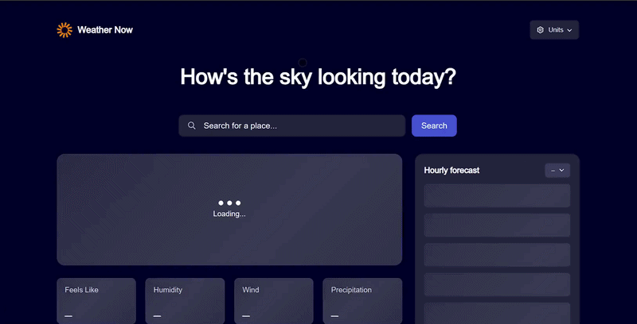

# Weather App

<p align="center">
  
</p>

A weather application for checking the weather, searching for cities, and selecting a day of the week. Built with Next.js, TypeScript, Zustand, and React Query, with a focus on high performance and testability.

---

## 🛠 Tech Stack

- **Framework:** Next.js 16 (App Router, Server and Client Components)
- **Language:** TypeScript
- **State Management:** Zustand
- **API:**
  - Server-side API for fetching weather data for the selected city
  - Client-side API for searching cities (`getCities`) with error handling
- **UI:**
  - CSS Modules with modern CSS features: `@container`, `@layer`, `:has()`, `clamp()`
  - Skeleton loaders for all loading components
  - Lazy loading of components using `dynamic()`
  - Controlled components (`useState`) and memoization(`useMemo`, `memo`)
  - Debounce city search using `useEffect` + `useState`
- **Optimization:**
  - React Query with caching, placeholderData, and staleTime
  - PPR (Pure Prop Rendering) to reduce unnecessary re-renders

---

## ⚡ Features

- **City Search:**
  - Input is highlighted in red when fewer than 3 characters are entered
  - City API request is triggered after a debounce delay
  - The selected city is passed to the server via `searchParams` to fetch weather data

- **Day of the Week Selection:**
  - Dropdown for selecting a day
  - The selected day is stored in Zustand

- **Skeletons and Loading States:**
  - Skeleton loaders are displayed while data is being fetched
  - Lazy loading of components to optimize rendering

---

## 🧪 Testing

- **Unit и Integration:** Vitest + React Testing Library
- **E2E:** Playwright
- Test coverage includes:
  - Controlled inputs (SearchForm)
  - Day selection dropdown (SelectDay)
  - Skeleton and lazy-loaded components
  - API requests and debounce behavior
  - Visual logic testing using CSS classes and data-testid

---

## 🚀 Installation and Running

1. Clone the repository:

```bash
git clone https://github.com/Git-Hub-Dmitriy/Portfolio.git
cd Weather
```

Run the application:

2. docker compose up -d --build
